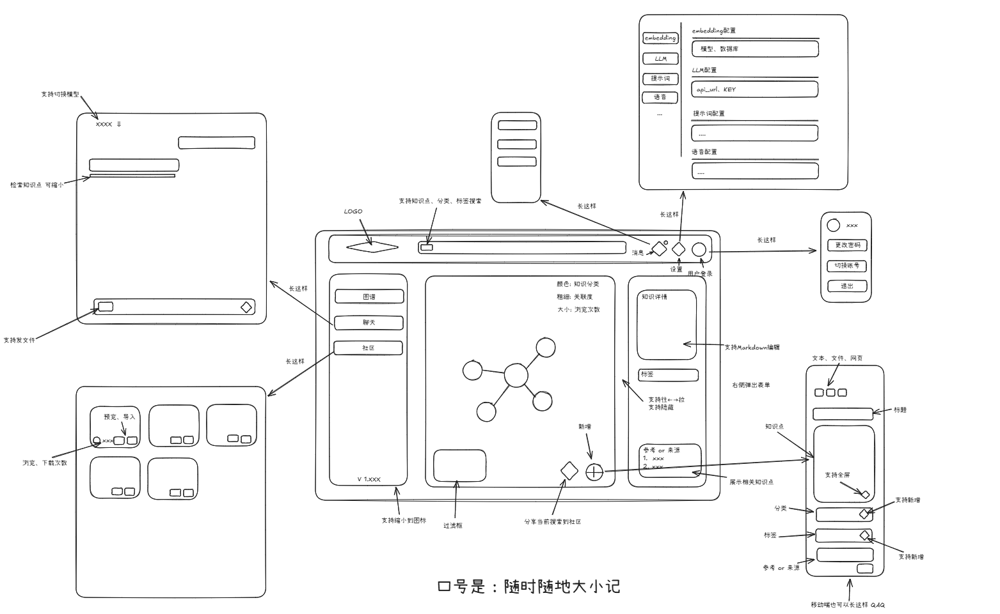

# 项目概述

PrismMind 是一个帮助用户随时随地记录、连接和检索知识的智能平台。通过 AI 技术，它能够扩展您的知识，发现知识间的关联，形成类似神经元的知识网络。

## 核心设计理念

在信息和 AI 生成内容爆炸的时代，个人难以记住和消化海量知识。本应用基于"道生一，一生二，二生三，三生万物"的哲学，构建类似神经元的知识链接网络，让用户能够将零散知识点连接起来，形成一个有机整体，实现"一通百通"的学习效果。

## UI草稿

## 主要功能模块

### 知识点录入与 AI 增强

- 快速记录：用户可随时记录看到的知识点，支持文本、截图、语音输入
- AI 知识扩展：自动分析输入的知识点，提供关键概念解释
- 知识关联推荐：AI 自动推荐与当前知识点相关的其他知识，形成初步链接
- 知识深度分析：提供背景信息、应用场景、相关技术等多维度扩展
- 自定义标签：用户可为知识点添加个性化标签

### 知识图谱构建与可视化

- 网状结构展示：以图形化方式展示知识点之间的连接
- 多维度链接：支持按相似性、依赖关系、应用场景等多种维度建立链接
- 链接强度标记：显示知识点之间关联的强弱程度
- 交互式图谱：用户可拖拽、缩放、重组知识图谱
- 时间轴视图：展示知识获取的时间序列

### 知识搜索与发现

- 多维度搜索：支持关键词、标签、领域等多种搜索方式
- 关联知识展示：搜索结果同时展示直接和间接关联的知识点
- 知识路径分析：展示从一个知识点到另一个知识点的连接路径
- 热门知识推荐：基于用户兴趣和学习历史推荐相关知识
- 知识缺口识别：识别用户知识网络中的薄弱环节，提供学习建议

### AI 智能助手

- 知识库对话：基于个人知识库内容回答问题
- 知识解释与简化：将复杂知识点转化为易于理解的表述
- 学习计划生成：根据知识图谱分析，生成个性化学习路径
- 知识更新提醒：当相关领域有新发展时，提供更新建议
- 跨领域知识关联：发现不同领域知识之间的潜在联系

### 社区与分享功能

- 知识图谱分享：分享个人的知识连接发现
- 协作学习：与朋友共同构建特定领域的知识网络
- 专家图谱订阅：订阅领域专家分享的知识结构
- 学习小组：基于共同兴趣形成学习社区
- 知识贡献评价：对有价值的知识贡献进行社区评价
